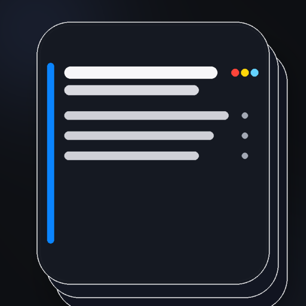
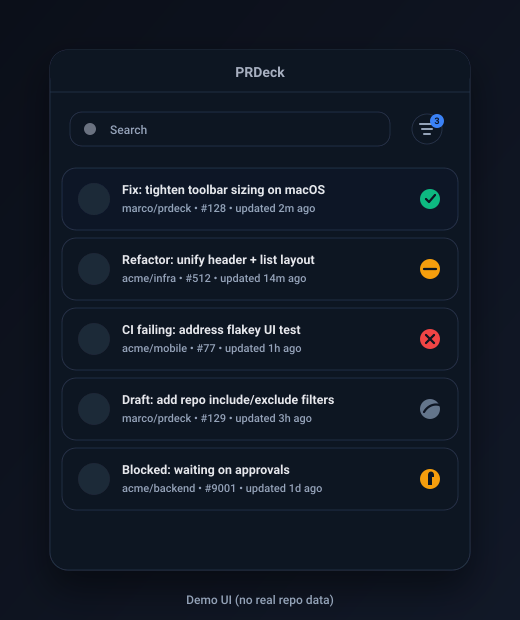

# PRDeck

<p align="center">
  
</p>

A keyboard-first PR inbox for GitHub on macOS — powered by the GitHub CLI (`gh`).

PRDeck shows:
- Pull requests you authored (`author:@me`)
- Pull requests requesting your review (`review-requested:@me`)

It’s built for fast triage: copy links with a click, open with a double-click, and navigate with the keyboard.

## Screenshot

<p align="center">
  
</p>

## Requirements

- macOS 14+
- GitHub CLI installed: `gh`
- Logged in: `gh auth login`

## Install

There aren’t prebuilt releases yet.

For now, build from source:
1. Clone the repo
2. Open `PRDeck.xcworkspace` in Xcode
3. Build & run the `PRDeck` scheme

## Usage

### Mouse
- Row: **click** copies PR link, **double-click** opens PR
- Status icon: **click** copies the relevant link (PR/checks), **double-click** opens it
- Right-click a row for a context menu (copy/open PR, checks, CI logs)

### Keyboard
- `⌘F`: focus search (press `Esc` to blur)
- `⌘R` (or `r`): refresh
- `j` / `k`: move selection
- `Enter`: open selected PR
- `c`: open checks for selected PR
- `f`: open failing check (if available)
- `t`: toggle “Needs attention” vs “All”
- `⌘+` / `⌘-` / `⌘0`: zoom in / out / reset
- `Esc`: close the filters screen

### Filters & Appearance
Use the filter icon to open the filters screen:
- PR scope: needs attention vs all
- Repo filtering: include or exclude repositories
- Appearance: theme + show/hide repo/org avatar

## Data & Privacy

PRDeck does not collect analytics or send telemetry.

It shells out to `gh` for GitHub data, and caches a local snapshot for faster startup.
See `PRIVACY.md` for details.

## Troubleshooting

### “GitHub CLI (`gh`) not found”

Install it with Homebrew:

```sh
brew install gh
```

PRDeck looks for `gh` in your `PATH` plus common locations like `/opt/homebrew/bin`, `/usr/local/bin`, and `/usr/bin`.

### Authentication errors

Make sure you’re logged in:

```sh
gh auth status
gh auth login
```

## Development

This repo uses a workspace + Swift Package setup:

```
PRDeck.xcworkspace/              # Open this file in Xcode
PRDeck/                          # App shell (minimal)
PRDeckPackage/Sources/PRDeckFeature/  # Primary feature code
PRDeckUITests/                   # UI tests
```

## Roadmap (ideas)

- Signed + notarized releases (zip/dmg)
- Homebrew cask
- Optional menu bar mode + badge/notifications
- Optional “Open at login”

## License

See `LICENSE`.
